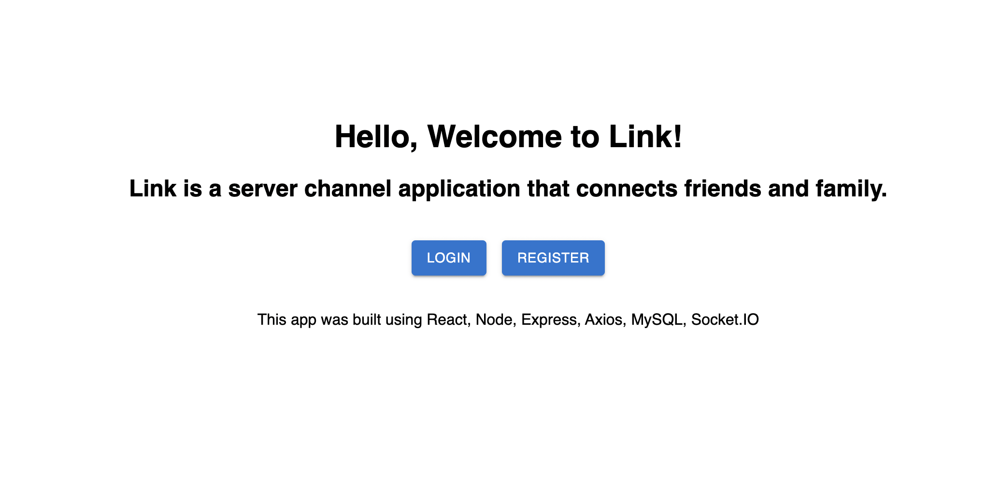
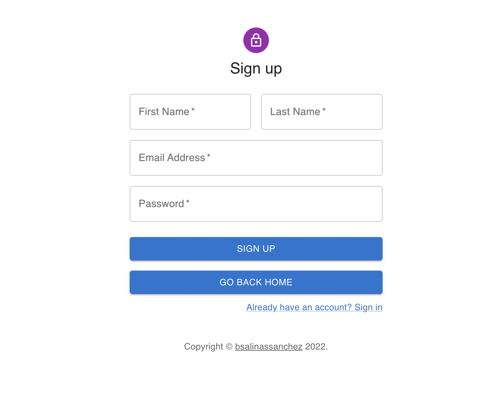
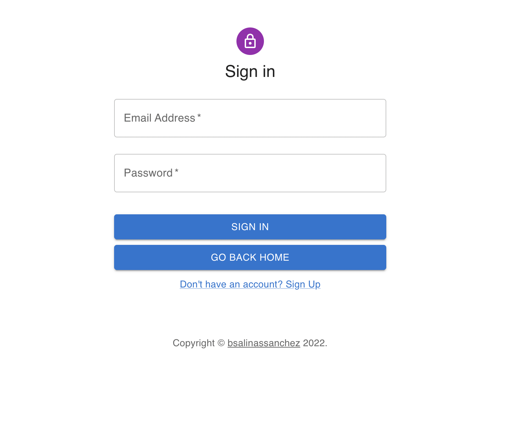
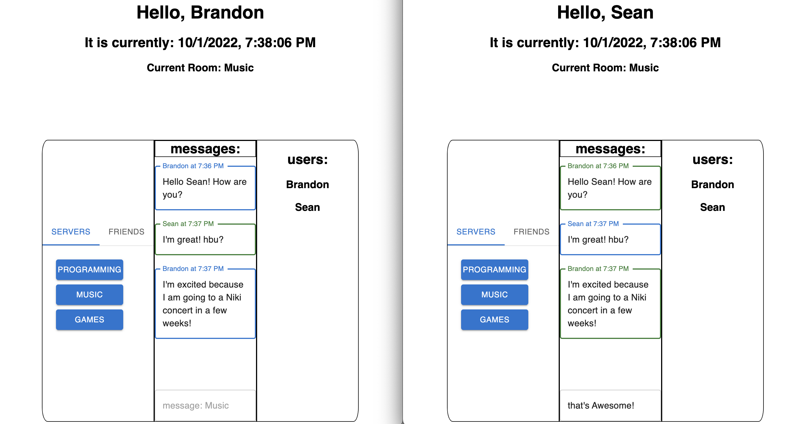

# link-chatroom

#### This app is not published

### About the App

Link is a chatroom messaging application where people can join a room or talk to users individually. Users can create an account and sign in. While making this application, I took inspiration from Discord when implementing the room messaging.

### Screenshots

### Technologies

I built this application using React, Node.js, Socket.io, Axios, express, MySQL, Javascript, HTML, and CSS

### Setup
- download or clone the repository

client setup:
- cd into client folder
- run `npm install`
- run `npm start`

server setup:
- cd into server folder in different terminal
- run `npm install`
- run `node index.js`

### Status

Though I am happy at the current state of this project, I plan on expanding utility and features in the future!

### License

MIT license @ bsalinassanchez
